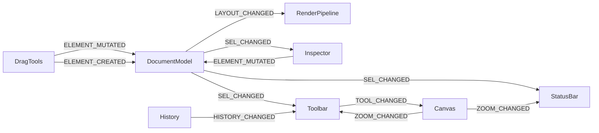

# Event System

All inter-module communication uses `RF.Core.EventBus` — a simple publish/subscribe bus.

## API

```js
RF.on(RF.E.LAYOUT_CHANGED, (data) => { /* handler */ });
RF.emit(RF.E.STATUS, 'Element moved');
```

## Event reference

### Core layout events

| Event constant | String | Payload | Emitted by |
|----------------|--------|---------|------------|
| `LAYOUT_CHANGED` | `layout:changed` | — | DocumentModel mutations |
| `ELEMENT_CREATED` | `element:created` | `{element}` | DragTools, Explorer |
| `ELEMENT_DELETED` | `element:deleted` | `{ids[]}` | App.deleteSelected |
| `ELEMENT_MUTATED` | `element:mutated` | `{id, props}` | Inspector, DragTools |
| `SECTION_MUTATED` | `section:mutated` | `{secId}` | SectionExpert |

### Selection events

| Event constant | String | Payload |
|----------------|--------|---------|
| `SEL_CHANGED` | `sel:changed` | `{ids: Set}` |
| `SEL_CLEARED` | `sel:cleared` | — |

### UI events

| Event constant | String | Payload |
|----------------|--------|---------|
| `STATUS` | `status` | `string` message |
| `ZOOM_CHANGED` | `zoom:changed` | `{zoom: number}` |
| `TOOL_CHANGED` | `tool:changed` | `string` tool name |
| `INSPECTOR_REFRESH` | `inspector:refresh` | — |
| `SNAP_GUIDES` | `snap:guides` | `{lines[]}` |
| `GUIDES_CHANGED` | `guides:changed` | — |
| `HISTORY_CHANGED` | `history:changed` | `{canUndo, canRedo}` |

### Module open events

| Event constant | String | Opens |
|----------------|--------|-------|
| `FORMULA_OPEN` | `formula:open` | Formula Workshop |
| `PARAMS_OPEN` | `params:open` | Parameters dialog |
| `GROUPS_OPEN` | `groups:open` | Group/Sort Expert |
| `FILTERS_OPEN` | `filters:open` | Select Expert |
| `PREVIEW_OPEN` | `preview:open` | Preview panel |
| `PREVIEW_CLOSE` | `preview:close` | — |
| `COND_FMT_OPEN` | `condfmt:open` | Conditional Formatting |
| `CHART_OPEN` | `chart:open` | Chart editor |
| `SUBREPORT_OPEN` | `subreport:open` | Subreport dialog |
| `SECTION_EXPERT_OPEN` | `section-expert:open` | Section Expert |
| `RT_OPEN` | `rt:open` | Running Totals Expert |
| `TOPN_OPEN` | `topn:open` | Top-N Expert |
| `REPO_OPEN` | `repo:open` | Repository Explorer |

## Event flow diagram


