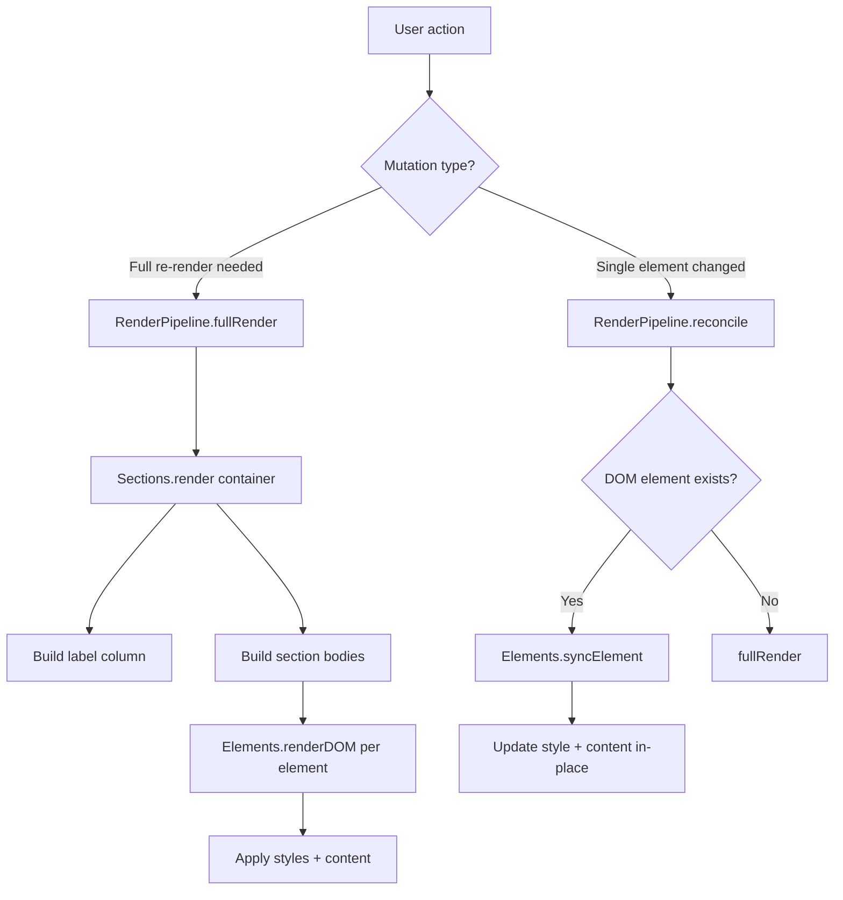
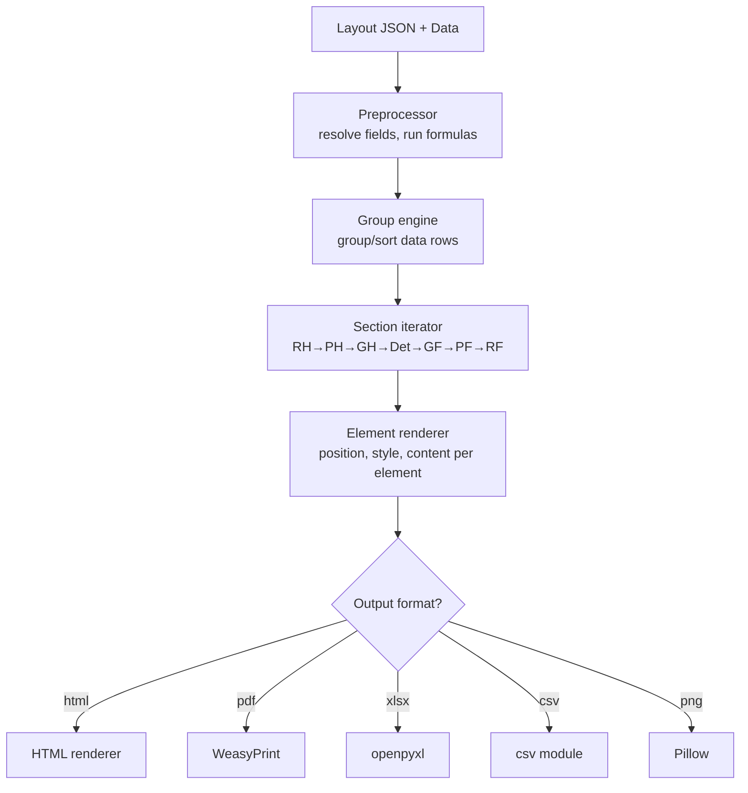
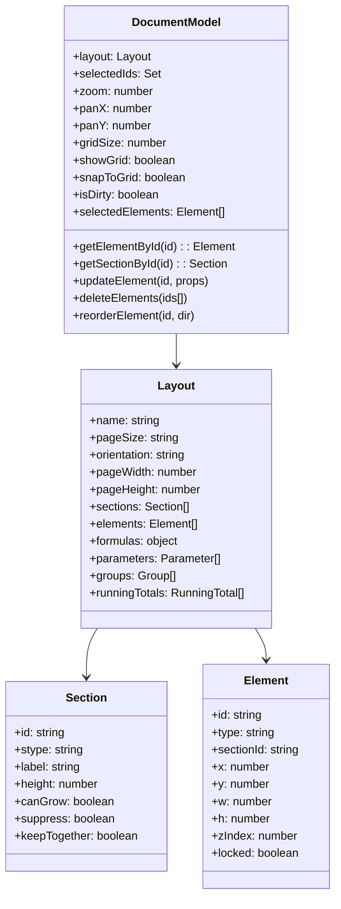

# Render Pipeline

## Frontend pipeline

```mermaid
flowchart TD
    A[User action] --> B{Mutation type?}
    B -->|Full re-render needed| C[RenderPipeline.fullRender]
    B -->|Single element changed| D[RenderPipeline.reconcile]

    C --> E[Sections.render container]
    E --> F[Build label column]
    E --> G[Build section bodies]
    G --> H[Elements.renderDOM per element]
    H --> I[Apply styles + content]

    D --> J{DOM element exists?}
    J -->|Yes| K[Elements.syncElement]
    J -->|No| L[fullRender]
    K --> M[Update style + content in-place]
```

## Backend render pipeline

```mermaid
flowchart TD
    IN[Layout JSON + Data] --> P[Preprocessor<br/>resolve fields, run formulas]
    P --> G[Group engine<br/>group/sort data rows]
    G --> S[Section iterator<br/>RH→PH→GH→Det→GF→PF→RF]
    S --> E[Element renderer<br/>position, style, content per element]
    E --> F{Output format?}
    F -->|html| H[HTML renderer]
    F -->|pdf| PDF[WeasyPrint]
    F -->|xlsx| XL[openpyxl]
    F -->|csv| CSV[csv module]
    F -->|png| PNG[Pillow]
```

## DocumentModel structure

```mermaid
classDiagram
    class DocumentModel {
        +layout: Layout
        +selectedIds: Set
        +zoom: number
        +panX: number
        +panY: number
        +gridSize: number
        +showGrid: boolean
        +snapToGrid: boolean
        +isDirty: boolean
        +selectedElements: Element[]
        +getElementById(id): Element
        +getSectionById(id): Section
        +updateElement(id, props)
        +deleteElements(ids[])
        +reorderElement(id, dir)
    }

    class Layout {
        +name: string
        +pageSize: string
        +orientation: string
        +pageWidth: number
        +pageHeight: number
        +sections: Section[]
        +elements: Element[]
        +formulas: object
        +parameters: Parameter[]
        +groups: Group[]
        +runningTotals: RunningTotal[]
    }

    class Section {
        +id: string
        +stype: string
        +label: string
        +height: number
        +canGrow: boolean
        +suppress: boolean
        +keepTogether: boolean
    }

    class Element {
        +id: string
        +type: string
        +sectionId: string
        +x: number
        +y: number
        +w: number
        +h: number
        +zIndex: number
        +locked: boolean
    }

    DocumentModel --> Layout
    Layout --> Section
    Layout --> Element
```
