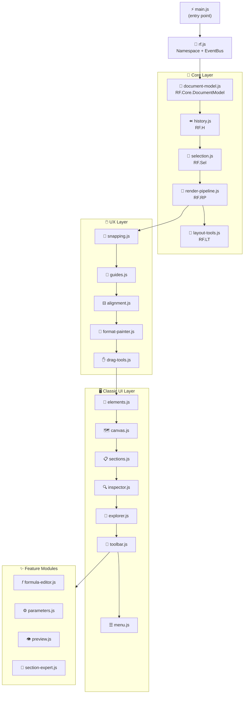
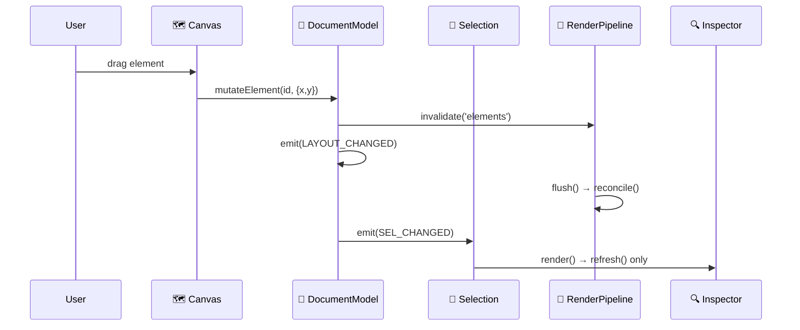

# 🏗️ Architecture Overview

ReportForge is built as a **layered ES Module application** — 52 focused files, no bundler, no build step.

---

## 📦 Module Dependency Graph



---

## ⚡ Event Bus (RF.E)

All cross-module communication goes through `RF.emit` / `RF.on`. **No direct method calls between layers.**



### 📋 Event Constants

| Event | Trigger | Consumers |
|-------|---------|-----------|
| `LAYOUT_CHANGED` | Any document mutation | RenderPipeline, StatusBar |
| `SEL_CHANGED` | Selection updated | Inspector, StatusBar, Toolbar |
| `INSPECTOR_REFRESH` | Position nudge | Inspector (values only) |
| `PREVIEW_OPEN` / `PREVIEW_CLOSE` | F5 / Esc | Preview module |
| `ZOOM_CHANGED` | Ctrl+Wheel | Canvas, StatusBar |
| `TOOL_CHANGED` | Tool hotkey | Canvas cursor, Toolbar |
| `SECTION_RESIZE` | Drag section handle | DocumentModel, Canvas |

---

## 🔄 Render Pipeline

`RF.RP` manages three render modes with **layer invalidation**:

```
RF.RP.invalidate('sections')   → fullRender()   (structure changed)
RF.RP.invalidate('elements')   → reconcile()    (elements added/removed/moved)
RF.RP.invalidate('selection')  → Sel.syncDOM()  (selection handles only)
```

> ⚡ `fullRender()` diffs section IDs before rebuilding — sections that haven't changed are updated in-place.

---

## 🎨 Modern CSS Architecture

### @layer Cascade

```css
@layer reset, tokens, base, layout, components, states, utilities;
```

| Layer | File | Contents |
|-------|------|---------|
| `tokens` | `base.css` | All CSS variables — palette, spacing, radius, shadow, z-index, typography |
| `components` | `toolbar.css`, `canvas.css`, `modals.css`, `v4.css` | UI component rules |
| `layout` | `panels.css` | Workspace, sidebars, inspector |

### 🎯 Design Token Scales

| Scale | Tokens | Range |
|-------|--------|-------|
| **Spacing** | `--space-1` … `--space-8` | 2px → 32px |
| **Radius** | `--radius-0`, `--radius-sm`, `--radius-md`, `--radius-lg` | 0 → 6px |
| **Shadow** | `--shadow-sm`, `--shadow-md`, `--shadow-lg` | subtle → strong |
| **Z-index** | `--z-base` … `--z-tooltip` | 0 → 9000 |
| **Typography** | `--text-xs` … `--text-lg` | 9px → 14px |
| **Fluid** | `--sidebar-w`, `--inspector-w` | `clamp()` based |

### 📦 Container Queries

| Container | Name | Behavior |
|-----------|------|---------|
| `#field-explorer` | `field-explorer` | `< 140px` hides counts/icons; `< 100px` hides search |
| `#property-inspector` | `inspector` | `< 180px` narrows labels; `< 140px` hides labels |
| `#canvas-area` | `canvas-area` | `< 500px` hides rulers |

### ♿ Interactions

- **`:focus-visible`** — keyboard-only focus rings, no mouse artifacts
- **`prefers-reduced-motion`** — all transitions/animations suppressed
- **`transform: translateY(1px)`** — tactile active/press feedback
- **`[disabled]` / `[aria-disabled]`** — unified `opacity:.45; pointer-events:none`

---

## 📁 File Structure

```
designer/
├── 📄 index.html          Entry point (0 inline styles)
├── 🎨 favicon.svg
├── css/
│   ├── index.css          @layer declarations + @imports
│   ├── base.css           Design tokens (65+ vars)
│   ├── toolbar.css        Menu bar + toolbars 1 & 2
│   ├── panels.css         Workspace, sidebars, inspector + container queries
│   ├── canvas.css         Canvas surface, sections, elements, handles
│   ├── modals.css         Dialogs, preview overlay
│   └── v4.css             Context menu, panel tabs, v4 extensions
└── js/
    ├── main.js            Import order + DOMContentLoaded boot
    ├── rf.js              RF namespace + EventBus + RF.E constants
    ├── app.js             RF.App — init, keyboard, zoom, tools
    ├── core/              document-model · history · selection
    │                      render-pipeline · layout-tools
    ├── ux/                snapping · guides · alignment · format-painter
    │                      drag-tools · object-group · panel-splitter
    │                      context-menu · field-drag-ghost · panel-tabs
    ├── classic/           elements · canvas · sections · inspector
    │                      explorer · toolbar · menu · sections-v4
    │                      status-bar-v4 · toolbar-v4
    └── modules/           formula-editor · parameters · groups · filters
                           tables · charts · subreports · conditional-fmt
                           section-expert · object-explorer · preview
                           preview-nav · running-totals · crosstab · topn
                           multi-section · report-explorer · sql-editor
                           formula-debugger · barcode-editor · rich-text-editor
                           map-editor · formula-editor-v4 · repository-explorer
```
