# ✨ CR Fidelity Refactor — Phase Log

Documents the **8-phase Crystal Reports fidelity refactor** applied to the designer frontend, plus the modern CSS architecture upgrade.

---

## 🗓️ Phase Overview

```mermaid
gantt
    title CR Fidelity Refactor Phases
    dateFormat  X
    axisFormat  Phase %s

    section 🎨 CSS Only
    Phase 1 - Light palette + Tahoma   :done, p1, 1, 2
    Phase 2 - Toolbar + status bar     :done, p2, 2, 3
    Phase 3 - Panels + inspector       :done, p3, 3, 4

    section 🖼️ CSS + Markup
    Phase 4 - Canvas + section labels  :done, p4, 4, 5

    section ⚙️ JS
    Phase 5 - Icon toolbar + fmt bar   :done, p5, 5, 6
    Phase 6 - Menu bar module          :done, p6, 6, 7
    Phase 7 - Design/Preview tabs      :done, p7, 7, 8
    Phase 8 - Property grid inspector  :done, p8, 8, 9
```



---

## 🎨 Phase 1 — CSS Variables + Typography

**Files:** `css/base.css`

Replaced the dark blue palette with Windows/Crystal Reports light chrome. Removed Google Fonts import.

| Before | After |
|--------|-------|
| `#0D1117` body background | `#F0F0F0` chrome background |
| IBM Plex Sans, 12.5px | Tahoma, 11px |
| Blue glow primary | Windows blue `#0078D7` |
| `--danger: #EF4444` | `--danger: #CC0000` |

> Legacy `--bg*` vars kept as aliases so existing JS references continue to resolve.

---

## 🔧 Phase 2 — Toolbar + Status Bar

**Files:** `css/toolbar.css`, `css/panels.css`

- Menu bar height: `28px` → `22px`
- Toolbar background: gradient `#FEFEFE` → `#E4E6EA`
- Toolbar border: `#334155` → `#8E8F8F`
- Status bar: dark → `#F0F0F0` chrome with `#C0C0C0` separators
- Button hover: blue glow → `#E5F1FB` / `#90C8F6` (Windows Aero style)
- Button press: `#CCE4F7` / `#3C7FB1`

---

## 🔍 Phase 3 — Panels + Inspector

**Files:** `css/panels.css`

- Inspector header: dark gradient → `#1C6AC8` → `#1355A3` (CR blue)
- Field explorer: `#0D1117` → `#F0F0F0` chrome
- Panel splitter: `2px` dark → `1px` `#C0C0C0`
- Section color chips → removed; `pi-type-label` clean text

---

## 🗺️ Phase 4 — Canvas + Section Labels

**Files:** `css/canvas.css`, `js/classic/sections.js`

Section labels moved from horizontal color bands to a **22px left column**.

```
Before:                          After:
┌──────────────────────────┐     ┌──┬────────────────────────┐
│ ■ REPORT HEADER          │     │RH│                        │
│ (dark band, 20px)        │     ├──┤ (white body)           │
│ white body area...       │     │  │                        │
└──────────────────────────┘     └──┴────────────────────────┘
```

Other canvas changes:
- Canvas surround: `#1A2035` → `#808080`
- Rulers: dark navy → white bg, black ticks
- Selection handles: `8×8 rounded` → `6×6 solid #0078D7`
- Snap guides: amber → `#FF0000` · user guides: cyan → `#00AAFF`

---

## ⚙️ Phase 5 — Icon Toolbar + Format Bar

**Files:** `css/toolbar.css`, `js/classic/toolbar.js`

- All `.tb-btn span` labels hidden via CSS (no markup change)
- `_render2()` rebuilt: font picker (130px), size (38px), **B/I/U**, alignment shortcuts
- `_applyFont()`, `_applyFontSize()`, `_applyFmt()` write directly to DocumentModel
- `_updateFmtBar()` syncs controls on `SEL_CHANGED`

---

## ☰ Phase 6 — Menu Bar

**Files:** `js/classic/menu.js` *(new)*, `js/main.js`, `js/app.js`, `css/toolbar.css`, `index.html`

Full Windows-style menu bar: `File · Edit · View · Insert · Format · Report · Window · Help`

- Alt key activates first menu; arrows navigate; Escape closes
- `_togglePanel()` shows/hides field explorer and inspector

---

## 🗂️ Phase 7 — Design/Preview Tabs

**Files:** `index.html`, `css/toolbar.css`, `js/app.js`, `css/modals.css`

- `#canvas-tabs` strip with Design and Preview tabs above canvas
- F5 → preview; Escape → design
- Preview overlay: fullscreen light `var(--canvas-surround)` background
- Preview topbar: 26px gradient toolbar matching main toolbars

---

## 🔍 Phase 8 — Property Grid Inspector

**Files:** `js/classic/inspector.js`

- `_sortMode` property with Category/Alphabetical toggle (☰ / AZ)
- `pi-type-label` replaces `pi-type-badge` (clean text, no color chip)
- Non-destructive render: caches `_lastRenderedId`, skips full rebuild when same element re-selected

---

## 🐛 Bugs Fixed

| ID | File | Fix |
|----|------|-----|
| B1 | `app.js` | Stray `};` and `})();` inside `_initKeyboard()` (IIFE merge artifact) |
| B2 | `app.js` | Invalid object literal `const pt={(x:...)}` → `const pt={x:...}` |

---

## 🎨 Color Audit — CR Screenshot Match

Visual comparison with SAP Crystal Reports for SAP Business One:

| Token | Before | After | Region |
|-------|--------|-------|--------|
| `--canvas-surround` | `#808080` | `#7DA7C4` | Canvas area background |
| `--doctab-bar-bg` | *(new)* | `#D8DCE4` | Design/Preview tab strip |
| Canvas scrollbar track | `#F0F0F0` | `#5B8EAD` | Scrollbar track |
| Canvas scrollbar thumb border | — | `#7DA7C4` | Scrollbar thumb outline |

> ✅ Already matching: `#F0F0F0` toolbars · `#FFFFFF` page · `#DCDFE4` section labels
